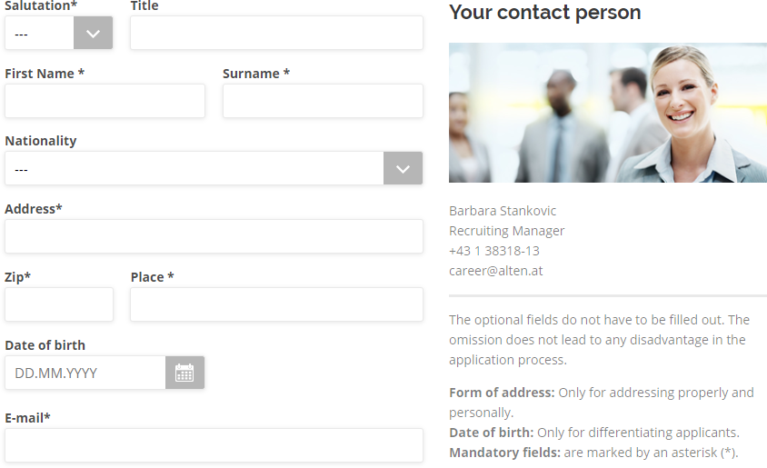

# Online application form

https://www.alten.at/en/career/apply/3461/



### Validation

- No / unclear max length constraints.


### Inconsistencies

- Field title and drop-down value casing (**T**itle **C**ase / **S**entence **c**ase [I'd enforce the latter]).
- Mandatory field mark usage ("Field title\*" / "Field title_\*"); additionally I'd give the asterisk another color, the same as the highlight color of an invalid field value (after the validation, the red border color in your case; see "Email address" on your [contact form](https://www.alten.at/en/contact.html)), for optical differentiation between the field title and the mandatory field annotation (especially in the "Field title\*" variant).
- **Salutation\*** is referenced as **Form of address** ("for addressing properly and personally") in the aside area; its drop-down does not contain "Mx." ("Misc." / "Ind."), contained in the job title ("m/f/**d**").
- **Date of birth**, "for differentiating applicants" ("der **sicheren** Unterscheidung von Bewerbern" in German version), which sounds strange, being non-mandatory and non-unique by its nature (multiple applicants being born on the same date, unlikely, nonetheless possible), in comparison with the mandatory email address / phone number. 
- **Salary requirement in € per year** in contrast to the (inclusive lower bound of the) **monthly** salarly (range) given in the job description, ignoring the possibility of ranged expectations (depending on offered conditions) from the applicant's perspective; marked as mandatory, being non-mandatory ("No salary requirements"); with inconsequent pluralization (requirement / requrement**s**).
- (Nonexistent) English localization of: "Mitarbeiterempfehlung", "Plakatkampagne", "Sonstige Aushänge", "Bewerbungsmappencheck", "Deutschlandstipendium", "Infostand", "Studententag", etc.
- **Where did you hear about ALTEN?\*** has drop-down values of different magnitudes (regarding scope of the used terms) like "Facebook", "Studyflix", and "Website" (Facebook and Studyflix being corporate entities [portals / social networks] having websites); the latter seems to represent "Somewhere else on the Internet [newsgroup, chat, forum, etc.] / Unspecified", meaning being not strictly mandatory, like 
- **At which job market did you find out about us?\*** given "Job market" as an definite answer to the previous question with the "Other job portals" drop-down value available as an answer for this one, hyperbolized in the following sample:

```
Which fruits do you like the most?*

a) Apples
b) Oranges
c) Tomatoes
d) Other vegetables

(For placing concrete orders, if missing; for you to find in our refreshment area.)
```

### Wording

`Actual term. "Proposal", justification.`

- **First ~~N~~name\***. "Forename", in symmetry to the "surname" as it's counterpart (not "last name", actually), in consistence with "Your forename" on your [contact form](https://www.alten.at/en/contact.html).
- **Telephone\***. "Primary phone" [number], as it might be a mobile one at the same time; the one to be used first.
- **Mobile**. "Secondary phone" [number], as a fallback; a mobile phone is a telephone too - its counterpart would be a stationary phone, being a technical feature you don't care about, I suppose. For the sake of completeness, I wouldn't differentiate between a business and a personal phone either, in this case at least: while calling an applicant during business hours using a business phone, you don't want to use applicant's current business phone number, right? To cut a long story even shorter: I'd ask for a single personal "phone" [number], being a mobile one nowadays, having a mobile box as a fallback, besides the mandatory personal e-mail address (secured by a single, most likely the same, mobile phone using two-factor authentication).

### Cross-cutting concerns

Consistency is key:

|Job application form|Contact form|
|:-------------------|:-----------|
|Title|Titel|
|First Name|Your forename|
|Address|Street, house number|
|Zip|Post code|
|Place|Town|
|Telephone|Tel. No.|
|Mobile|Mobile No.|
|E-mail|Email address|
|Short letter/Comments|Your message|

Please note, that salutation is not mandatory on your contact form, which makes "addressing properly and personally" (from your application form) less important to you, while giving you the technical ability to sort or filter the applications by applicant's sexual characteristics (hypothetically speaking).